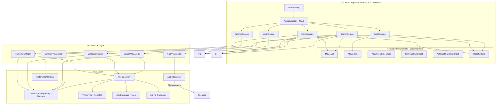
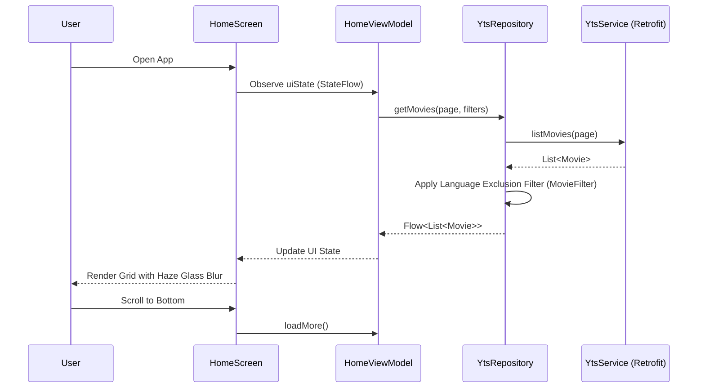
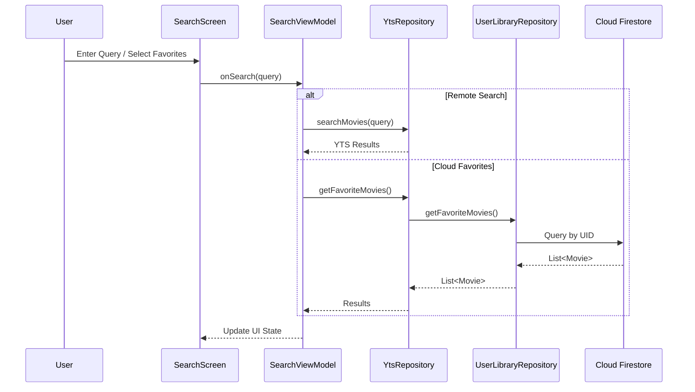
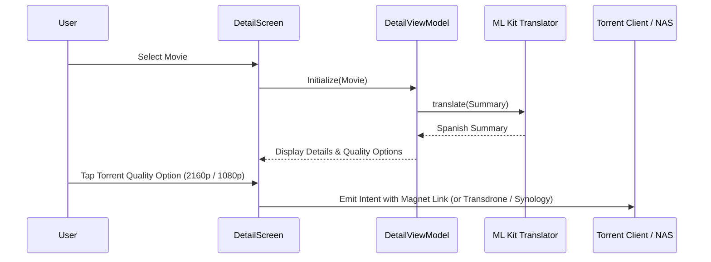
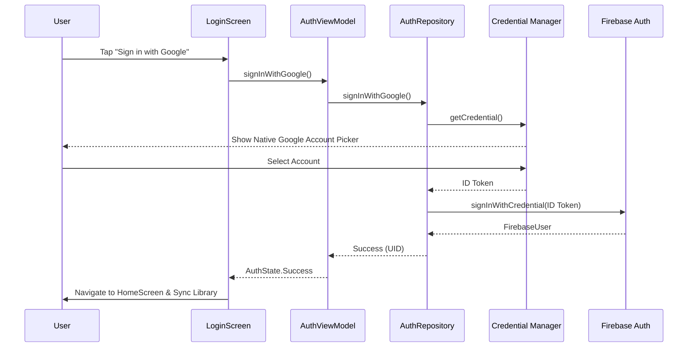

# Architecture & Workflows — La Torrentola

Detailed technical documentation covering system architecture, design patterns, modular UI components, and data flow diagrams for **La Torrentola**.

---

## 🏗️ System Architecture Overview

The application follows **Android Clean Architecture** principles paired with reactive **MVVM (Model-View-ViewModel)**. It is structured as a **Single-Activity App** using Jetpack Compose and AndroidX Navigation 3.

---

## 🎨 UI Architecture & Visual System

### 1. Haze 2.0 Visual Blur System
* **Platform Requirements**: Hardware-accelerated real-time blur (`RenderEffect`) requires Android 12+ (API 31+).
* **Pre-Android 12 Fallback**: On devices running API < 31 and during Android Studio Compose Previews, the app gracefully falls back to a semi-opaque surface container (`surface.copy(alpha = 0.9f)`) to prevent invisible or overlapping content.
* **Animated Interpolation (`EaseInOutCubic`)**: Translucent opacity (`hazeAlpha`) is calculated dynamically based on grid scroll state (`gridState`). It interpolates smoothly between `1.0f` (at rest at the top) and `0.15f` (when scrolled) over 600 ms using `EaseInOutCubic`.
* **Full-Screen `hazeSource`**: The scrollable list container fills the entire screen (`fillMaxSize()`) behind the top header and bottom system navigation bar, delivering a true edge-to-edge frosted glass experience.

### 2. Android TV D-Pad Focus Navigation Engine
* **Single Vertical Layout Tree (`isTv`)**: On TVs and Chromecasts (`isTv == true`), headers and grid lists reside in a single vertical `Column` layout tree. This eliminates focus search dead zones between filter chips and grid items.
* **Native TV Components (`androidx.tv.material3.Surface`)**: All chips and buttons on TV use `tv-material3` components (`TvChip`), providing smooth focus scaling (`focusedScale = 1.1f` or `1.05f`).
* **YouTube Player Focus Isolation**: Embedded `YouTubePlayerView` instances block D-pad focus stealing via `descendantFocusability = ViewGroup.FOCUS_BLOCK_DESCENDANTS`, overlaying a native `IconButton` for play/pause control.

---

## 📦 Data Layer & Hybrid Persistence

1. **Retrofit 3.0 + Gson**: Fetches movie catalog data from the YTS API.
2. **Cloud Firestore (Cloud-First Sync)**: Synchronizes user favorites, download history, and language exclusion filters in the cloud, linked to their Google account UID.
3. **Room Database (Local Metadata)**: Stores session-specific local metadata (genre stats and last visit timestamps).
4. **Google ML Kit Translate**: Performs local, on-device AI translation of movie summaries from English to Spanish without network latency or cloud API fees.

---

## 🔄 Sequence & Flow Diagrams

### 1. Movie Discovery & Pagination Flow

### 2. Search & Cloud Favorites Sync

### 3. Movie Details, On-Device Translation & Magnet Links

### 4. Google Credential Manager Authentication

