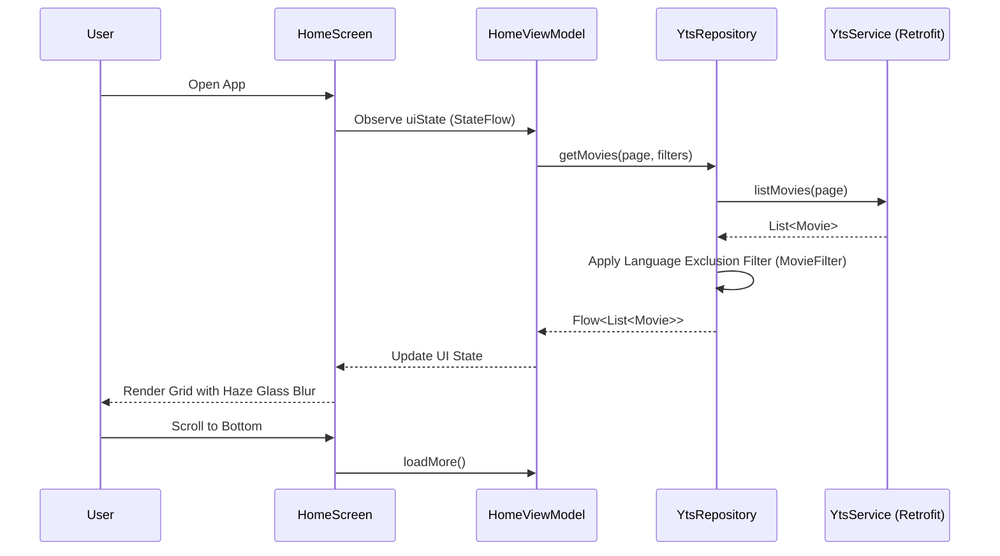
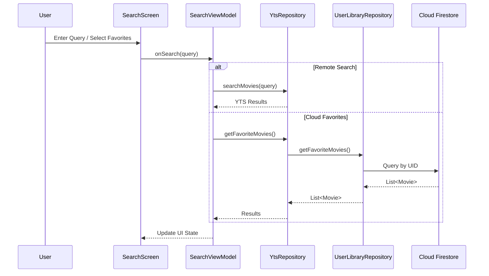
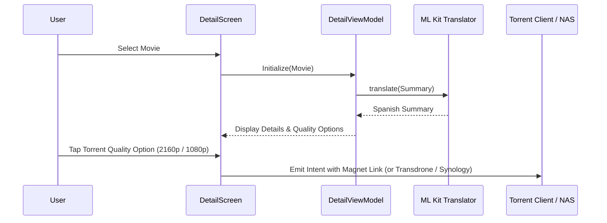
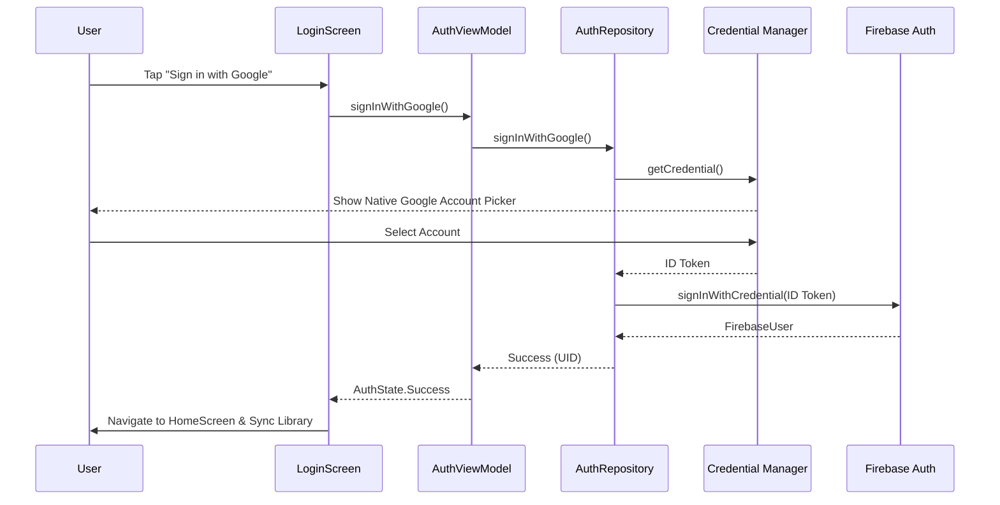

# Architecture & Workflows — La Torrentola

Detailed technical documentation covering system architecture, design patterns, modular UI components, and data flow diagrams for **La Torrentola**.

---

## 🏗️ System Architecture Overview

The application follows **Android Clean Architecture** principles paired with reactive **MVVM (Model-View-ViewModel)**. It is structured as a **Single-Activity App** using Jetpack Compose and AndroidX Navigation 3.

```mermaid
graph TD
    subgraph UI_Layer [UI Layer - Jetpack Compose & TV Material3]
        MA[MainActivity]
        NV[AppNavigation - Nav3]
        LS[LoginScreen]
        HS[HomeScreen]
        DS[DetailScreen]
        SS[SearchScreen]
        STS[SettingsScreen]
        TVGR[TvGenreResultsScreen]
        TVDS[TvDetailScreen]
        TVES[TvEpisodeDetailScreen]
        
        subgraph Modular_Components [Reusable Components - ui/components]
            ML[MovieList]
            MI[MovieItem]
            AC[AdaptiveChip / Chips]
            TVC[TV catalog components / TvSeriesGrid]
            GB[GenreBottomSheet]
            AB[ActorDetailBottomSheet]
            PL[Placeholders]
        end
    end

    subgraph Presentation_Layer [Presentation Layer]
        AVM[AuthViewModel]
        HVM[HomeViewModel]
        DVM[DetailViewModel]
        SVM[SearchViewModel]
        STVM[SettingsViewModel]
        TVHVM[TvHomeViewModel]
        TVGVM[TvGenreResultsViewModel]
        TVDVM[TvDetailViewModel]
        TVEVM[TvEpisodeDetailViewModel]
    end

    subgraph Data_Layer [Data Layer]
        AREP[AuthRepository]
        UREP[UserLibraryRepository - Firestore]
        REP[YtsRepository]
        RS[YtsService - Retrofit 3]
        TR[TmdbRepository / TmdbService]
        ER[EztvRepository / EztvService]
        DB[AppDatabase - Room]
        TVGDAO[TvGenreDao]
        MLK[ML Kit Translator]
        PM[PreferenceManager]
    end

    MA --> NV
    NV --> LS & HS & DS & SS & STS
    NV --> TVGR & TVDS & TVES
    HS & SS --> ML & AC & PL
    TVGR & TVDS & TVES --> TVC & PL
    DS --> MI & PL
    
    LS --> AVM
    HS --> HVM
    DS --> DVM
    SS --> SVM
    STS --> STVM
    HS --> TVHVM
    TVGR --> TVGVM
    TVDS --> TVDVM
    TVES --> TVEVM
    
    AVM --> AREP
    AREP -->|Firebase Auth| FAN[Firebase]
    HVM & DVM & SVM & STVM & TVDVM & TVEVM --> UREP
    HVM & DVM & SVM --> REP
    STVM --> PM
    REP --> RS
    REP --> DB
    REP --> MLK
    REP --> UREP
    TVHVM & TVGVM & TVDVM & TVEVM --> TR
    TVEVM --> ER
    TR --> TVGDAO
    TR -->|TMDB API| TMDB[The Movie Database]
    ER -->|EZTV API| EZTV[EZTV]
    TVGDAO --> DB
```

**TV series catalog path:** Home deliberately hosts two separate feeds. The movie path uses YTS and `Movie`; the TV path uses TMDB and `TmdbTvSummary`/`TmdbTvEpisode`. Series IDs remain TMDB IDs throughout navigation. EZTV lookup is keyed by the linked IMDb ID, not the TMDB ID.

### TV Subsystem Entry Points

| Concern | Main implementation |
|---|---|
| Home feeds, genre chips, series grid, and focus state | `ui/home/HomeScreen.kt`, `ui/home/TvHomeViewModel.kt`, `ui/components/TvCatalogComponents.kt` |
| TV genre discovery and sorting | `ui/home/TvGenreResultsScreen.kt`, `ui/home/TvGenreResultsViewModel.kt` |
| Series/season/episode details | `ui/detail/TvDetailScreen.kt`, `TvDetailViewModel.kt` |
| Episode release lookup, magnet launch, and episode record creation | `ui/detail/TvEpisodeDetailScreen.kt`, `TvEpisodeDetailViewModel.kt` |
| TMDB and EZTV transport/data access | `network/TmdbService.kt`, `TmdbRepository.kt`, `EztvService.kt`, `EztvRepository.kt` |
| Local genre usage and cloud episode history | `database/TvGenreDao.kt`, `model/stats/TvGenreStats.kt`, `model/user/DownloadedEpisode.kt`, `network/UserLibraryRepository.kt` |
| Typed route definitions and screen transitions | `ui/navigation/AppNavigation.kt` |

---

## 🎨 UI Architecture & Visual System

### 1. Haze 2.0 Visual Blur System
* **Platform Requirements**: Hardware-accelerated real-time blur (`RenderEffect`) requires Android 12+ (API 31+).
* **Pre-Android 12 Fallback**: On devices running API < 31 and during Android Studio Compose Previews, the app gracefully falls back to a semi-opaque surface container (`surface.copy(alpha = 0.9f)`) to prevent invisible or overlapping content.
* **Animated Interpolation (`EaseInOutCubic`)**: Translucent opacity (`hazeAlpha`) is calculated dynamically based on grid scroll state (`gridState`). It interpolates smoothly between `1.0f` (at rest at the top) and `0.15f` (when scrolled) over 600 ms using `EaseInOutCubic`.
* **Full-Screen `hazeSource`**: The scrollable list container fills the entire screen (`fillMaxSize()`) behind the top header and bottom system navigation bar, delivering a true edge-to-edge frosted glass experience.

### 2. Android TV D-Pad Focus Navigation Engine
* **Single Vertical Layout Tree (`isTv`)**: On TVs and Chromecasts (`isTv == true`), headers and grid lists reside in a single vertical `Column` layout tree. This eliminates focus search dead zones between filter chips and grid items.
* **Native TV Components (`androidx.tv.material3.Surface`)**: All chips and buttons on TV use `tv-material3` components (`TvChip`), providing smooth focus scaling (`focusedScale = 1.1f` or `1.05f`).
* **YouTube Player Focus Isolation**: Embedded `YouTubePlayerView` instances block D-pad focus stealing via `descendantFocusability = ViewGroup.FOCUS_BLOCK_DESCENDANTS`, overlaying a native `IconButton` for play/pause control.

---

## 📦 Data Layer & Hybrid Persistence

1. **Retrofit 3.0 + Gson**: Fetches movie catalog data from the YTS API.
2. **TMDB Retrofit service**: Supplies TV feeds, genres, genre discovery, TV details, seasons/episodes, and series external IDs. `TMDB_API_KEY` is injected via `BuildConfig` from local build configuration; it must not be hardcoded.
3. **EZTV Retrofit service**: Supplies torrent releases for a numeric IMDb ID. `EztvRepository` filters the series results by exact season and episode number and sorts matches by seeds.
4. **Cloud Firestore (Cloud-First Sync)**: Synchronizes user favorites and movie downloads separately from TV episode downloads. Episode records use `DownloadedEpisode` in `users/{uid}/tv_downloads/{hash}`.
5. **Room Database (Local Metadata)**: Stores session metadata and separate movie/TV genre usage. `TvGenreDao` persists `tv_genre_stats`; TV genres are ordered by usage and then name.
6. **Google ML Kit Translate**: Performs local, on-device AI translation of movie summaries from English to Spanish without network latency or cloud API fees.

---

## 🔄 Sequence & Flow Diagrams

### 1. Movie Discovery & Pagination Flow

```mermaid
sequenceDiagram
    participant U as User
    participant HS as HomeScreen
    participant VM as HomeViewModel
    participant R as YtsRepository
    participant N as YtsService (Retrofit)

    U->>HS: Open App
    HS->>VM: Observe uiState (StateFlow)
    VM->>R: getMovies(page, filters)
    R->>N: listMovies(page)
    N-->>R: List<Movie>
    R->>R: Apply Language Exclusion Filter (MovieFilter)
    R-->>VM: Flow<List<Movie>>
    VM-->>HS: Update UI State
    HS-->>U: Render Grid with Haze Glass Blur
    U->>HS: Scroll to Bottom
    HS->>VM: loadMore()
```

### 2. TV Series Discovery, Episode Releases & Downloads
```mermaid
sequenceDiagram
    participant U as User
    participant HS as HomeScreen
    participant TVVM as TvHomeViewModel / TvGenreResultsViewModel
    participant TD as TmdbRepository / TmdbService
    participant TMDB as TMDB
    participant DB as TvGenreDao / Room
    participant NAV as AppNavigation
    participant SD as TvDetailScreen / TvDetailViewModel
    participant ED as TvEpisodeDetailScreen / TvEpisodeDetailViewModel
    participant EZ as EztvRepository / EZTV
    participant UL as UserLibraryRepository / Firestore
    participant EXT as Torrent Client

    U->>HS: Select TV mode or genre
    HS->>TVVM: Activate feed / record genre visit
    TVVM->>TD: Request feed or discover by genre (paged)
    TD->>TMDB: TV API request with configured API key
    TMDB-->>TD: Series pages / TV genres
    TD-->>TVVM: Series data
    TD->>DB: Observe/update local TV genre usage
    TVVM-->>HS: Render sorted genre chips and series grid
    U->>HS: Select a series
    HS->>NAV: Route.TvDetail(seriesId)
    NAV->>SD: Open series details
    SD->>TD: Fetch series and selected season episodes
    TD->>TMDB: TV details / season requests
    TMDB-->>SD: Series metadata and episodes
    U->>SD: Select episode
    SD->>NAV: Route.TvEpisodeDetail(seriesId, season, episode, metadata)
    NAV->>ED: Open episode details
    ED->>TD: Resolve series IMDb external ID
    TD->>TMDB: TV external_ids request
    TMDB-->>ED: IMDb ID
    ED->>EZ: Get releases by IMDb ID; match season/episode
    EZ-->>ED: Matching EZTV torrents, seed-sorted
    U->>ED: Select release
    ED->>UL: Save DownloadedEpisode by hash
    UL->>UL: users/{uid}/tv_downloads/{hash}
    ED->>EXT: ACTION_VIEW magnet (CATEGORY_BROWSABLE)
```

**Ownership and identifiers:** TV catalog, genre discovery, and details are TMDB-backed; torrent release metadata is EZTV-backed. Navigation carries the TMDB series ID plus season/episode identity. The TMDB external-ID endpoint bridges to IMDb, and EZTV expects the IMDb numeric part without `tt`. Room stores only local TV genre visit statistics; Firestore stores per-user TV episode download history in its own `tv_downloads` subcollection.

### 3. Search & Cloud Favorites Sync

```mermaid
sequenceDiagram
    participant U as User
    participant SS as SearchScreen
    participant VM as SearchViewModel
    participant R as YtsRepository
    participant UR as UserLibraryRepository
    participant FS as Cloud Firestore

    U->>SS: Enter Query / Select Favorites
    SS->>VM: onSearch(query)
    alt Remote Search
        VM->>R: searchMovies(query)
        R-->>VM: YTS Results
    else Cloud Favorites
        VM->>R: getFavoriteMovies()
        R->>UR: getFavoriteMovies()
        UR->>FS: Query by UID
        FS-->>UR: List<Movie>
        UR-->>R: List<Movie>
        R-->>VM: Results
    end
    VM-->>SS: Update UI State
```

### 4. Movie Details, On-Device Translation & Magnet Links

```mermaid
sequenceDiagram
    participant U as User
    participant DS as DetailScreen
    participant VM as DetailViewModel
    participant MLK as ML Kit Translator
    participant EXT as Torrent Client / NAS

    U->>DS: Select Movie
    DS->>VM: Initialize(Movie)
    VM->>MLK: translate(Summary)
    MLK-->>VM: Spanish Summary
    VM-->>DS: Display Details & Quality Options
    U->>DS: Tap Torrent Quality Option (2160p / 1080p)
    DS->>EXT: Emit Intent with Magnet Link (or Transdrone / Synology)
```

### 5. Google Credential Manager Authentication

```mermaid
sequenceDiagram
    participant U as User
    participant LS as LoginScreen
    participant VM as AuthViewModel
    participant R as AuthRepository
    participant CM as Credential Manager
    participant F as Firebase Auth

    U->>LS: Tap "Sign in with Google"
    LS->>VM: signInWithGoogle()
    VM->>R: signInWithGoogle()
    R->>CM: getCredential()
    CM-->>U: Show Native Google Account Picker
    U->>CM: Select Account
    CM-->>R: ID Token
    R->>F: signInWithCredential(ID Token)
    F-->>R: FirebaseUser
    R-->>VM: Success (UID)
    VM-->>LS: AuthState.Success
    LS->>U: Navigate to HomeScreen & Sync Library
```
