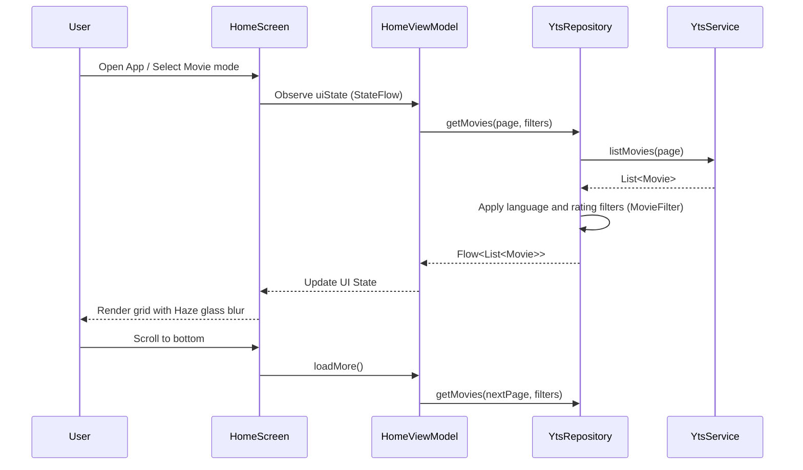
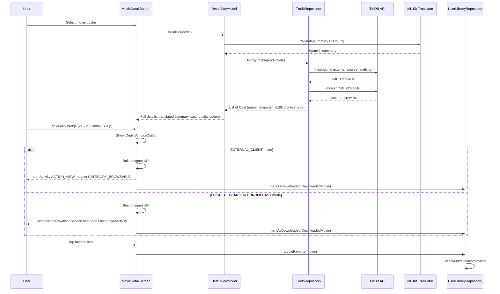
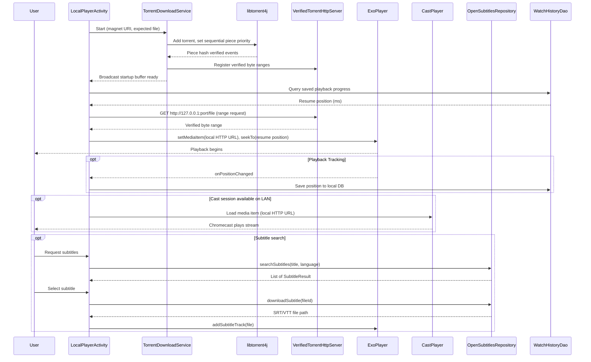
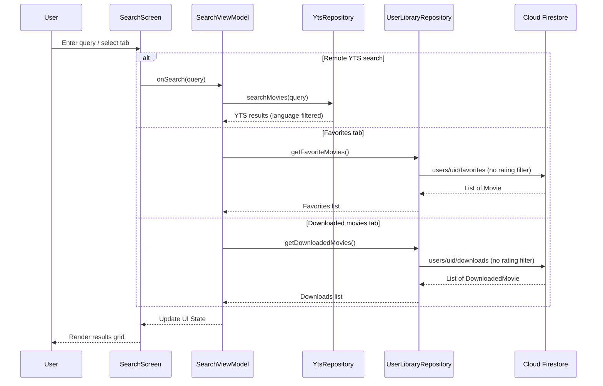
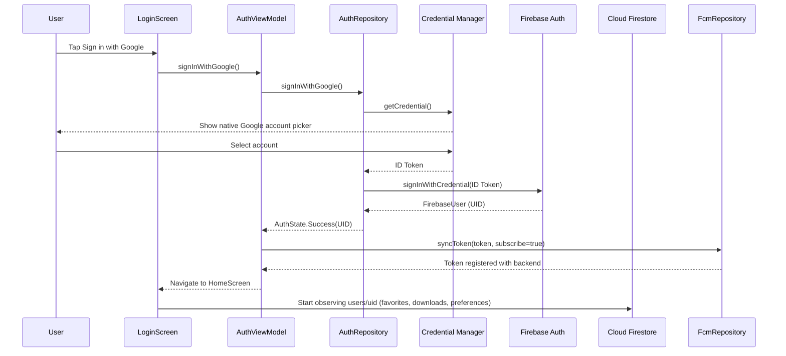
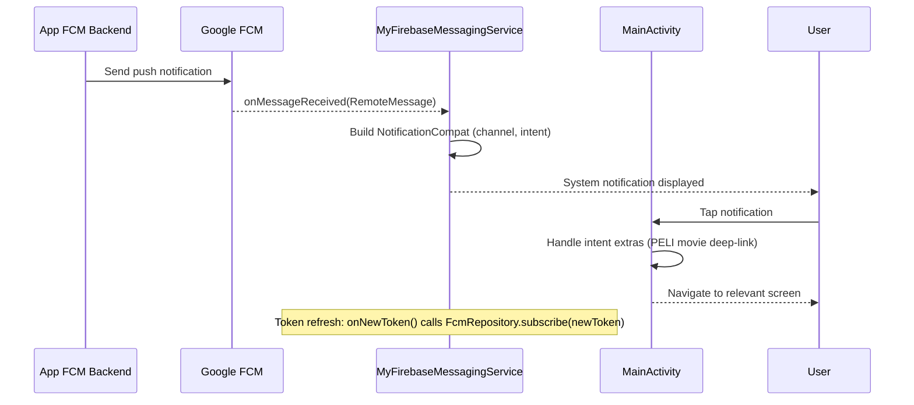

# Architecture & Workflows — La Torrentola

Detailed technical documentation covering system architecture, design patterns, modular UI components, and data flow diagrams for **La Torrentola**.

---

## 🏗️ System Architecture Overview

The application follows **Android Clean Architecture** principles paired with reactive **MVVM (Model-View-ViewModel)**. It is structured as a **Single-Activity App** using Jetpack Compose and AndroidX Navigation 3.

```mermaid
graph TD
    subgraph UI_Layer [UI Layer - Jetpack Compose and TV Material 3]
        MA[MainActivity]
        NV[AppNavigation - Nav3]
        LS[LoginScreen]
        HS[HomeScreen]
        DS[MovieDetailScreen]
        SS[SearchScreen]
        STS[SettingsScreen]
        TVGR[TvGenreResultsScreen]
        TVDS[TvDetailScreen]
        TVES[TvEpisodeDetailScreen]
        TDS[TorrentDownloadsScreen]
        LPA[LocalPlayerActivity]

        subgraph Modular_Components [Reusable Components - ui/components]
            ML[MovieList]
            MI[MovieItem]
            AC[AdaptiveChip/Chips]
            TVC[TvCatalogComponents/TvSeriesGrid]
            GB[GenreBottomSheet]
            AB[ActorDetailBottomSheet]
            PL[Placeholders]
            QD[QualityChoiceDialog]
        end
    end

    subgraph Presentation_Layer [Presentation Layer - ViewModels]
        AVM[AuthViewModel]
        HVM[HomeViewModel]
        DVM[DetailViewModel]
        SVM[SearchViewModel]
        STVM[SettingsViewModel]
        TVHVM[TvHomeViewModel]
        TVGVM[TvGenreResultsViewModel]
        TVDVM[TvDetailViewModel]
        TVEVM[TvEpisodeDetailViewModel]
        TDVM[TorrentDownloadsViewModel]
        TPVM[TvPlayerViewModel]
    end

    subgraph Data_Layer [Data Layer]
        AREP[AuthRepository]
        UREP[UserLibraryRepository - Firestore]
        REP[YtsRepository]
        RS[YtsService - Retrofit]
        TR[TmdbRepository / TmdbService]
        ER[EztvRepository / EztvService]
        OSR[OpenSubtitlesRepository / Service]
        FCMR[FcmRepository / FcmService]
        DB[AppDatabase - Room]
        GENDAO[GenreDao]
        TVGDAO[TvGenreDao]
        TDAO[TorrentDownloadDao]
        DATEDAO[DateDao]
        WDAO[WatchHistoryDao]
        MLK[ML Kit Translator]
        PM[PreferenceManager]
        TDS_SVC[TorrentDownloadService - Foreground]
        HTTP[VerifiedTorrentHttpServer]
    end

    subgraph External [External APIs and Services]
        YTS[YTS API]
        TMDB[TMDB API]
        EZTV[EZTV API]
        OSAPI[OpenSubtitles API]
        FCMBE[App FCM Backend]
        FIREBASE[Firebase Auth and Firestore]
        CAST[Chromecast / Cast SDK]
    end

    MA --> NV
    NV --> LS & HS & DS & SS & STS & TDS
    NV --> TVGR & TVDS & TVES
    MA --> LPA

    HS & SS --> ML & AC & PL
    TVGR & TVDS & TVES --> TVC & PL
    DS --> MI & PL & QD & AB
    TVES --> QD
    STS --> TDS

    LS --> AVM
    HS --> HVM & TVHVM
    DS --> DVM
    SS --> SVM
    STS --> STVM
    TVGR --> TVGVM
    TVDS --> TVDVM
    TVES --> TVEVM
    TDS --> TDVM
    LPA --> TPVM

    AVM --> AREP
    AREP -->|Firebase Auth| FIREBASE
    HVM & DVM & SVM & STVM & TVDVM & TVEVM --> UREP
    UREP -->|Firestore| FIREBASE
    HVM & DVM & SVM --> REP
    STVM --> PM & FCMR
    REP --> RS & DB & MLK & UREP
    RS -->|YTS API| YTS
    TVHVM & TVGVM & TVDVM & TVEVM --> TR
    TVEVM --> ER
    TR --> TVGDAO
    TR -->|TMDB API| TMDB
    ER -->|EZTV API| EZTV
    TVGDAO --> DB
    GENDAO --> DB
    TDAO --> DB
    DATEDAO --> DB
    WDAO --> DB
    DVM & TVEVM --> OSR
    OSR -->|OpenSubtitles API| OSAPI
    STVM --> UREP
    FCMR -->|FCM backend| FCMBE
    TDVM --> TDAO
    TDS_SVC --> TDAO & HTTP
    LPA --> TDS_SVC & HTTP & OSR & UREP & WDAO
    LPA -->|Cast SDK| CAST
```

**Dual catalog design:** Home hosts two independent feeds. The movie path sources from YTS using the `Movie` model; the TV path sources from TMDB using `TmdbTvSummary`/`TmdbTvEpisode`. Series IDs remain TMDB IDs throughout navigation. EZTV lookup is keyed by the linked IMDb ID (numeric part only, `tt` prefix stripped).

### TV Subsystem Entry Points

| Concern | Main implementation |
|---|---|
| Home feeds, genre chips, series grid, and focus state | `ui/home/HomeScreen.kt`, `ui/home/TvHomeViewModel.kt`, `ui/components/TvCatalogComponents.kt` |
| TV genre discovery and sorting | `ui/home/TvGenreResultsScreen.kt`, `ui/home/TvGenreResultsViewModel.kt` |
| Series/season/episode details | `ui/detail/TvDetailScreen.kt`, `TvDetailViewModel.kt` |
| Episode release lookup, magnet launch, and episode record creation | `ui/detail/TvEpisodeDetailScreen.kt`, `TvEpisodeDetailViewModel.kt` |
| TMDB and EZTV transport/data access | `network/TmdbService.kt`, `TmdbRepository.kt`, `EztvService.kt`, `EztvRepository.kt` |
| Local genre usage and cloud episode history | `database/TvGenreDao.kt`, `model/stats/TvGenreStats.kt`, `model/user/DownloadedEpisode.kt`, `network/UserLibraryRepository.kt` |
| Typed route definitions and screen transitions | `ui/navigation/AppNavigation.kt` |

### In-App Torrent & Playback Subsystem

| Concern | Main implementation |
|---|---|
| Download orchestration (libtorrent4j), piece verification, and queue | `service/TorrentDownloadService.kt` |
| Verified HTTP byte-range server for local & Cast playback | `service/VerifiedTorrentHttpServer.kt` |
| Local ExoPlayer + Cast player activity | `ui/player/LocalPlayerActivity.kt`, `ui/player/TvPlayerViewModel.kt` |
| Watch History tracking & persistence | `database/WatchHistoryDao.kt`, `network/UserLibraryRepository.kt` |
| In-app download management screen | `ui/downloads/TorrentDownloadsScreen.kt`, `TorrentDownloadsViewModel.kt` |
| Torrent mode setting (`EXTERNAL_CLIENT` / `LOCAL_PLAYBACK` / `CHROMECAST`) | `model/torrent/TorrentHandlingMode.kt` |
| Subtitle search and download | `network/OpenSubtitlesRepository.kt`, `OpenSubtitlesService.kt`, `OpenSubtitlesCredentialStore.kt` |
| Persistent in-app transfer records | `database/TorrentDownloadDao.kt`, `model/torrent/TorrentDownload.kt` |

---

## 🎨 UI Architecture & Visual System

### 1. Adaptive & Responsive UI (`isTvDevice`)
* **Shared Logic, Split Presentation**: The application logic (ViewModels/Repositories) is shared across mobile and Android TV, but the UI presentation layer completely branches based on `Context.isTvDevice()`.
* **Theme Injection**: Mobile uses `LaTorrentolaTheme(themeMode = preferenceManager.getTheme())` utilizing `androidx.compose.material3`. TV uses `TvLaTorrentolaTheme` utilizing `androidx.tv.material3`.
* **Adaptive Breakpoints**: Where TV components aren't explicitly used on mobile/tablet, Compose Window Size Classes determine layout span counts and navigation rail vs bottom bar presence.

### 2. Haze 2.0 Visual Blur System
* **Platform Requirements**: Hardware-accelerated real-time blur (`RenderEffect`) requires Android 12+ (API 31+).
* **Pre-Android 12 Fallback**: On devices running API < 31 and during Android Studio Compose Previews, the app falls back to a semi-opaque surface container (`surface.copy(alpha = 0.9f)`) to prevent invisible or overlapping content.
* **Animated Interpolation (`EaseInOutCubic`)**: Translucent opacity (`hazeAlpha`) is calculated dynamically based on grid scroll state (`gridState`). It interpolates smoothly between `1.0f` (at rest at the top) and `0.15f` (when scrolled) over 600 ms using `EaseInOutCubic`.
* **Full-Screen `hazeSource`**: The scrollable list container fills the entire screen (`fillMaxSize()`) behind the top header and bottom system navigation bar, delivering a true edge-to-edge frosted glass experience.

### 3. Android TV D-Pad Focus Navigation Engine
* **Single Vertical Layout Tree (`isTv`)**: On TVs and Chromecasts (`isTv == true`), headers and grid lists reside in a single vertical `Column` layout tree. This eliminates focus search dead zones between filter chips and grid items.
* **Native TV Components (`androidx.tv.material3.Surface`)**: All chips and buttons on TV use `tv-material3` components (`TvChip`), providing smooth focus scaling (`focusedScale = 1.1f` or `1.05f`).
* **Dialog Focus Trapping**: Android TV overlays use `androidx.compose.ui.window.Dialog` to prevent the D-pad focus engine from falling through to the underlying views (crucial for overlapping ExoPlayer surfaces).
* **YouTube Player Focus Isolation**: Embedded `YouTubePlayerView` instances block D-pad focus stealing via `descendantFocusability = ViewGroup.FOCUS_BLOCK_DESCENDANTS`, overlaying a native `IconButton` for play/pause control.

---

## 📦 Data Layer & Hybrid Persistence

1. **Retrofit + Gson**: Fetches movie catalog data from the YTS API.
2. **TMDB Retrofit service**: Supplies TV feeds, genres, genre discovery, TV details, seasons/episodes, cast/crew enrichment for movies via IMDb ID, and series external IDs. `TMDB_API_KEY` is injected via `BuildConfig`; it must not be hardcoded.
3. **EZTV Retrofit service**: Supplies torrent releases for a numeric IMDb ID. `EztvRepository` filters by exact season/episode and sorts matches by seed count.
4. **OpenSubtitles Retrofit service**: Searches and downloads subtitle tracks. Credentials (username/password) are securely encrypted inside the Android hardware Keystore via `OpenSubtitlesCredentialStore`; the API key is injected via `BuildConfig`.
5. **libtorrent4j (`TorrentDownloadService`)**: Foreground service managing a native libtorrent session. Downloads are queued, pieces are hash-verified, and byte ranges are served via `VerifiedTorrentHttpServer` only after verification. Raises `minSdk` to Android 9 (API 28).
6. **Media3 ExoPlayer + Cast SDK (`LocalPlayerActivity`)**: Plays media from the local HTTP server. Switches between `ExoPlayer` (local) and `CastPlayer` (Chromecast) when a Cast session becomes available on the same LAN.
7. **Cloud Firestore (Cloud-First Sync)**: Synchronizes user favorites and movie downloads (`users/{uid}/downloads/{hash}`) separately from TV episode downloads (`users/{uid}/tv_downloads/{hash}`). Also stores per-user cloud preferences (language filter, minimum rating).
8. **Room Database (Local Metadata)**: Acts as the Single Source of Truth for rapid UI access. Stores:
   * **Watch History**: `WatchHistoryDao` (Fast local UI resume, syncs to Firestore in background).
   * **Transfer Records**: `TorrentDownloadDao`.
   * **Usage Stats**: `GenreDao`, `TvGenreDao`, `DateDao`.
9. **Google ML Kit Translate**: On-device AI translation of movie summaries from English to Spanish.
10. **Firebase Cloud Messaging**: Push notifications managed by `FcmRepository`/`FcmService`. Token is registered with the app backend on sign-in and removed on sign-out. Deep linking implemented via Notification intents.

---

## 🔄 Sequence & Flow Diagrams

### 1. Movie Discovery & Pagination

```mermaid
sequenceDiagram
    participant U as User
    participant HS as HomeScreen
    participant VM as HomeViewModel
    participant R as YtsRepository
    participant N as YtsService

    U->>HS: Open App / Select Movie mode
    HS->>VM: Observe uiState (StateFlow)
    VM->>R: getMovies(page, filters)
    R->>N: listMovies(page)
    N-->>R: List<Movie>
    R->>R: Apply language and rating filters (MovieFilter)
    R-->>VM: Flow<List<Movie>>
    VM-->>HS: Update UI State
    HS-->>U: Render grid with Haze glass blur
    U->>HS: Scroll to bottom
    HS->>VM: loadMore()
    VM->>R: getMovies(nextPage, filters)
```

### 2. Movie Details, TMDB Cast Enrichment & Torrent Mode Selection

```mermaid
sequenceDiagram
    participant U as User
    participant DS as MovieDetailScreen
    participant VM as DetailViewModel
    participant TR as TmdbRepository
    participant TMDB as TMDB API
    participant MLK as ML Kit Translator
    participant UREP as UserLibraryRepository

    U->>DS: Select movie poster
    DS->>VM: Initialize(Movie)
    VM->>MLK: translate(summary EN to ES)
    MLK-->>VM: Spanish summary
    VM->>TR: findByImdbId(imdbCode)
    TR->>TMDB: find/imdb_id external_source=imdb_id
    TMDB-->>TR: TMDB movie ID
    TR->>TMDB: /movie/tmdb_id/credits
    TMDB-->>TR: Cast and crew list
    TR-->>VM: List of Cast (name, character, w185 profile image)
    VM-->>DS: Full details, translated summary, cast, quality options
    U->>DS: Tap quality badge (2160p / 1080p / 720p)
    DS->>DS: Show QualityChoiceDialog
    alt EXTERNAL_CLIENT mode
        DS->>DS: Build magnet URI
        DS-->>U: startActivity ACTION_VIEW magnet CATEGORY_BROWSABLE
        DS->>UREP: markAsDownloaded(DownloadedMovie)
    else LOCAL_PLAYBACK or CHROMECAST mode
        DS->>DS: Build magnet URI
        DS-->>U: Start TorrentDownloadService and open LocalPlayerActivity
        DS->>UREP: markAsDownloaded(DownloadedMovie)
    end
    U->>DS: Tap favorite icon
    DS->>UREP: toggleFavorite(movie)
    UREP->>UREP: users/uid/favorites/movieId
```

### 3. In-App Torrent Download, Playback, Watch History & Cast

```mermaid
sequenceDiagram
    participant U as User
    participant LPA as LocalPlayerActivity
    participant TDS as TorrentDownloadService
    participant LT as libtorrent4j
    participant HTTP as VerifiedTorrentHttpServer
    participant EXO as ExoPlayer
    participant CAST as CastPlayer
    participant OSR as OpenSubtitlesRepository
    participant WDAO as WatchHistoryDao

    LPA->>TDS: Start (magnet URI, expected file)
    TDS->>LT: Add torrent, set sequential piece priority
    LT-->>TDS: Piece hash verified events
    TDS->>HTTP: Register verified byte ranges
    TDS-->>LPA: Broadcast startup buffer ready
    LPA->>WDAO: Query saved playback progress
    WDAO-->>LPA: Resume position (ms)
    LPA->>HTTP: GET http://127.0.0.1:port/file (range request)
    HTTP-->>LPA: Verified byte range
    LPA->>EXO: setMediaItem(local HTTP URL), seekTo(resume position)
    EXO-->>U: Playback begins
    opt Playback Tracking
        EXO-->>LPA: onPositionChanged
        LPA->>WDAO: Save position to local DB
    end
    opt Cast session available on LAN
        LPA->>CAST: Load media item (local HTTP URL)
        CAST-->>U: Chromecast plays stream
    end
    opt Subtitle search
        U->>LPA: Request subtitles
        LPA->>OSR: searchSubtitles(title, language)
        OSR-->>LPA: List of SubtitleResult
        U->>LPA: Select subtitle
        LPA->>OSR: downloadSubtitle(fileId)
        OSR-->>LPA: SRT/VTT file path
        LPA->>EXO: addSubtitleTrack(file)
    end
```

### 4. TV Series Discovery, Episode Releases & Downloads
```mermaid
sequenceDiagram
    participant U as User
    participant HS as HomeScreen
    participant TVVM as TvHomeViewModel and TvGenreResultsViewModel
    participant TD as TmdbRepository
    participant TMDB as TMDB API
    participant DB as TvGenreDao/Room
    participant NAV as AppNavigation
    participant SD as TvDetailScreen/TvDetailViewModel
    participant ED as TvEpisodeDetailScreen/TvEpisodeDetailViewModel
    participant EZ as EztvRepository/EZTV
    participant UL as UserLibraryRepository/Firestore
    participant EXT as OS Torrent Client

    U->>HS: Select TV mode or genre chip
    HS->>TVVM: Activate feed / record genre visit
    TVVM->>TD: Request feed or discover by genre (paged)
    TD->>TMDB: TV API request with configured API key
    TMDB-->>TD: Series pages / TV genres
    TD-->>TVVM: Series data
    TD->>DB: Observe/update local TV genre usage
    TVVM-->>HS: Render sorted genre chips and series grid
    U->>HS: Select a series poster
    HS->>NAV: Route.TvDetail(tmdbSeriesId)
    NAV->>SD: Open series details
    SD->>TD: Fetch series metadata and first non-special season
    TD->>TMDB: /tv/id and /tv/id/season/n
    TMDB-->>SD: Series metadata and episodes
    U->>SD: Select episode
    SD->>NAV: Route.TvEpisodeDetail(seriesId, season, episode, metadata)
    NAV->>ED: Open episode details
    ED->>TD: Resolve series IMDb external ID
    TD->>TMDB: /tv/id/external_ids
    TMDB-->>ED: IMDb ID (tt prefix stripped for EZTV)
    ED->>EZ: Get releases by numeric IMDb ID; match S/E exactly
    EZ-->>ED: Matching EZTV torrents, seed-sorted
    U->>ED: Select release
    ED->>UL: Save DownloadedEpisode (users/uid/tv_downloads/hash)
    ED-->>EXT: ACTION_VIEW magnet URI (CATEGORY_BROWSABLE, no chooser)
```

### 5. Search & Cloud Library

```mermaid
sequenceDiagram
    participant U as User
    participant SS as SearchScreen
    participant VM as SearchViewModel
    participant R as YtsRepository
    participant UR as UserLibraryRepository
    participant FS as Cloud Firestore

    U->>SS: Enter query / select tab
    alt Remote YTS search
        SS->>VM: onSearch(query)
        VM->>R: searchMovies(query)
        R-->>VM: YTS results (language-filtered)
    else Favorites tab
        VM->>UR: getFavoriteMovies()
        UR->>FS: users/uid/favorites (no rating filter)
        FS-->>UR: List of Movie
        UR-->>VM: Favorites list
    else Downloaded movies tab
        VM->>UR: getDownloadedMovies()
        UR->>FS: users/uid/downloads (no rating filter)
        FS-->>UR: List of DownloadedMovie
        UR-->>VM: Downloads list
    end
    VM-->>SS: Update UI State
    SS-->>U: Render results grid
```

### 6. Google Credential Manager Authentication

```mermaid
sequenceDiagram
    participant U as User
    participant LS as LoginScreen
    participant VM as AuthViewModel
    participant R as AuthRepository
    participant CM as Credential Manager
    participant FA as Firebase Auth
    participant FS as Cloud Firestore
    participant FCM as FcmRepository

    U->>LS: Tap Sign in with Google
    LS->>VM: signInWithGoogle()
    VM->>R: signInWithGoogle()
    R->>CM: getCredential()
    CM-->>U: Show native Google account picker
    U->>CM: Select account
    CM-->>R: ID Token
    R->>FA: signInWithCredential(ID Token)
    FA-->>R: FirebaseUser (UID)
    R-->>VM: AuthState.Success(UID)
    VM->>FCM: syncToken(token, subscribe=true)
    FCM-->>VM: Token registered with backend
    VM-->>LS: Navigate to HomeScreen
    LS->>FS: Start observing users/uid (favorites, downloads, preferences)
```

### 7. Push Notifications & Deep Linking (FCM)

```mermaid
sequenceDiagram
    participant FCMBE as App FCM Backend
    participant GCM as Google FCM
    participant MFMS as MyFirebaseMessagingService
    participant MA as MainActivity
    participant U as User

    FCMBE->>GCM: Send push notification
    GCM-->>MFMS: onMessageReceived(RemoteMessage)
    MFMS->>MFMS: Build NotificationCompat (channel, intent)
    MFMS-->>U: System notification displayed
    U->>MA: Tap notification
    MA->>MA: Handle intent extras (PELI movie deep-link)
    MA-->>U: Navigate to relevant screen
    note over MFMS: Token refresh: onNewToken() calls FcmRepository.subscribe(newToken)
```

---

## 🔐 Identity and Ownership Notes

- **TV ID Bridging**: TV catalog, genre discovery, and details are TMDB-backed. Torrent release metadata is EZTV-backed. Navigation carries the TMDB series ID plus season/episode identity. The TMDB external-ID endpoint bridges to IMDb; EZTV expects the numeric part without `tt`.
- **Hybrid Persistence Paradigm**: Room stores local fast-access metadata (Watch History, transfer records, local usage statistics). Firestore acts as the definitive cloud backup (favorites, downloaded entities, preferences). **Data flow enforces Room as the Single Source of Truth for immediate UI reflection**, syncing to Firestore in the background. User collections (favorites, downloads) bypass runtime threshold filters like minimum rating.
- **Security Compliance**: Sensitive OpenSubtitles credentials exist only transiently in memory, encrypted at rest via the Android Keystore.
