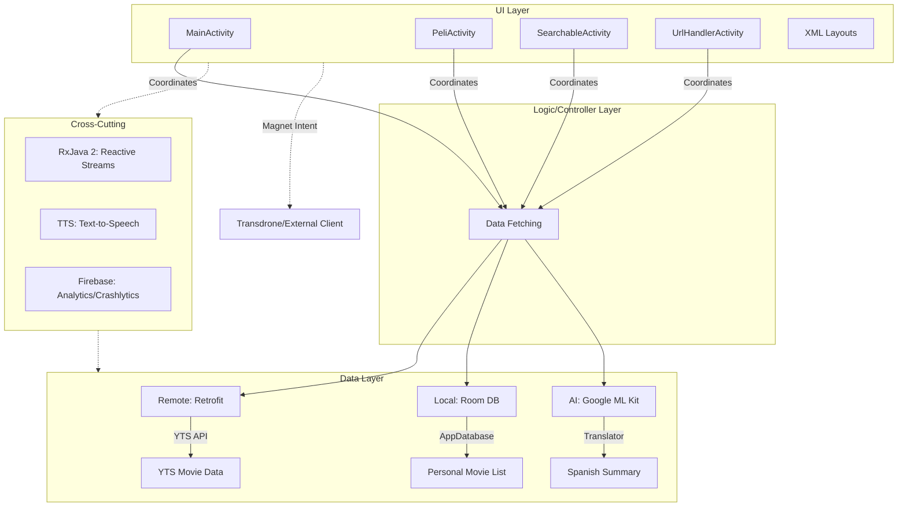
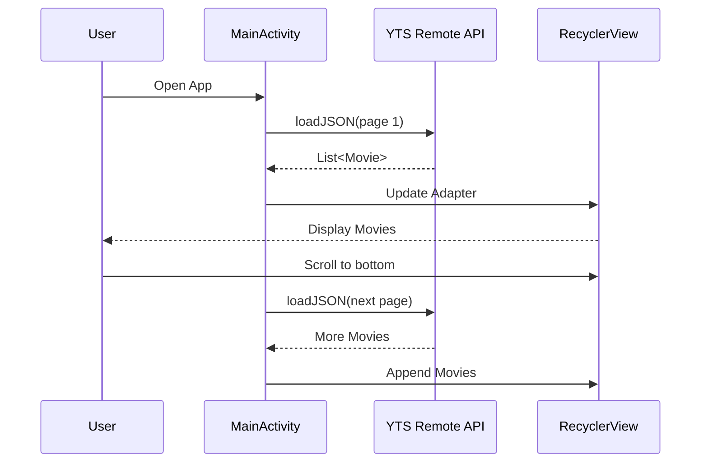
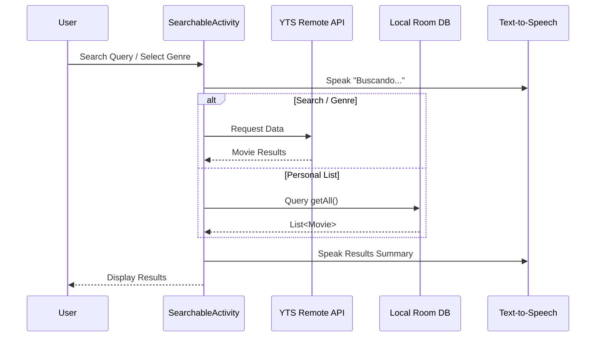
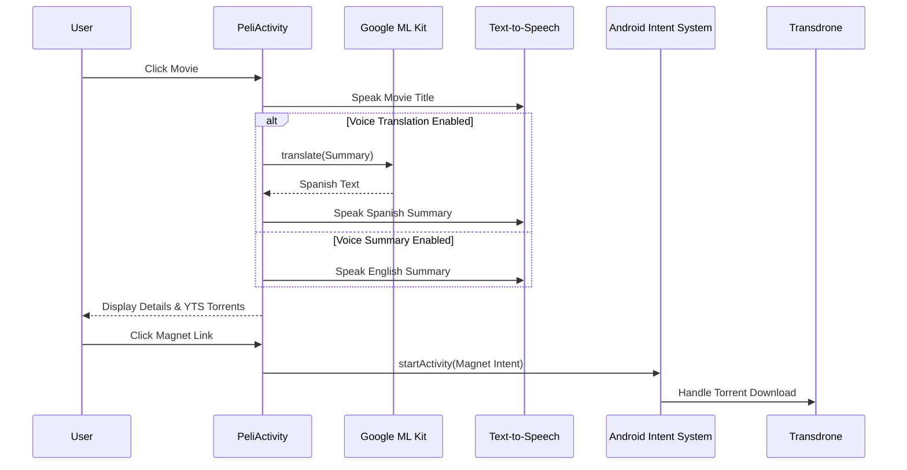
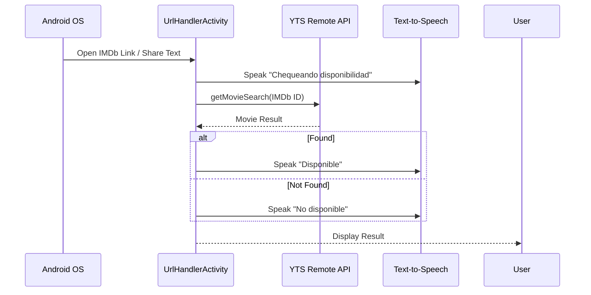

# La Torrentola 

La Torrentola is an example Android app made to test modern Android ecosystem functionalities and architectures.

**Purpose:** This app is a specialized discovery tool intended to be a companion for **[Transdrone](https://play.google.com/store/apps/details?id=com.nascent.transdrone)**. While La Torrentola handles movie discovery, data visualization, and accessibility, it intentionally transfers the responsibility of torrent management and downloading to Transdrone.

### Why use La Torrentola with Transdrone?

By delegating the actual download task to **Transdrone**, users gain several advantages:

1.  **Remote Management:** You can find a movie on your phone with La Torrentola and send the magnet link to Transdrone, which then manages the download on a remote server (like a home NAS or seedbox) rather than consuming your phone's storage and battery.
2.  **Protocol Support:** Transdrone supports a vast array of remote clients (uTorrent, Transmission, rTorrent, Synology, etc.), making La Torrentola compatible with almost any home setup.
3.  **Efficiency:** La Torrentola remains a lightweight discovery app, avoiding the heavy battery drain and data usage associated with running a full BitTorrent client on a mobile device.
4.  **Security & Privacy:** Downloads happen on your designated home server, allowing you to centralize your media and maintain better control over your network traffic.

## Architecture Overview

The app follows a **Model-View-Controller (MVC)** pattern, transitioning towards **MVVM**.



- **View:** XML layouts and Activities (`MainActivity`, `PeliActivity`, `SearchableActivity`, etc.).
- **Controller/Logic:** Activities handle user interaction and coordinate data fetching.
- **Model:** Data classes representing YTS API responses and Room entities.
- **Data Layer:** 
    - **Remote:** Retrofit interface for the YTS API.
    - **Local:** Room database (`AppDatabase`) for storing a personal movie list.
    - **AI:** Google ML Kit for on-device translation.
- **Async/Reactive:** RxJava 2 for handling network calls and database operations.

## Key Features & Technologies

1.  **Modern Build System:** Updated to **Android Gradle Plugin 8.7.0** and **Gradle 8.9**.
2.  **Android 15 Ready:** Target SDK 35 with **Edge-to-Edge** support (using `fitsSystemWindows`) to ensure the UI respects system bars.
3.  **On-Device Translation:** Replaced Yandex API with **Google ML Kit Translate** (English to Spanish) for movie summaries.
4.  **Accessibility:** Integrated **Text-to-Speech (TTS)** for reading movie details and translations.
5.  **Reactive Programming:** Extensive use of **RxJava 2** for asynchronous operations.
6.  **Networking:** **Retrofit 2** with reactive adapters.
7.  **Persistence:** **Room Persistence Library** for local storage.
8.  **Media Integration:** **YouTube Player** integration for trailers.
9.  **Firebase:** Integration with Analytics, Messaging, Crashlytics, and Sessions.

## Sequence Diagrams

### 1. Main Movie Discovery Flow


### 2. Search & Filter Flow


### 3. Movie Details & Translation Flow


### 4. Deep Link / URL Handling Flow


## Requirements

To compile the project, you need a `Constants.java` file in your `constants` package.

```java
public class Constants {
    public static final String YTS_BASE_URL = "https://yts.ag/api/v2/";
    public static final int PAGE_SIZE = 50;
}
```

## Next Steps

- Decouple views with **ViewModel**, moving from plain Android MVC to **MVVM**.
- Move to a pluggable architecture of torrent vendors to reduce coupling.
- Offer different switchable posters view with normal and staggered grids.
- Enhance notification handling.
