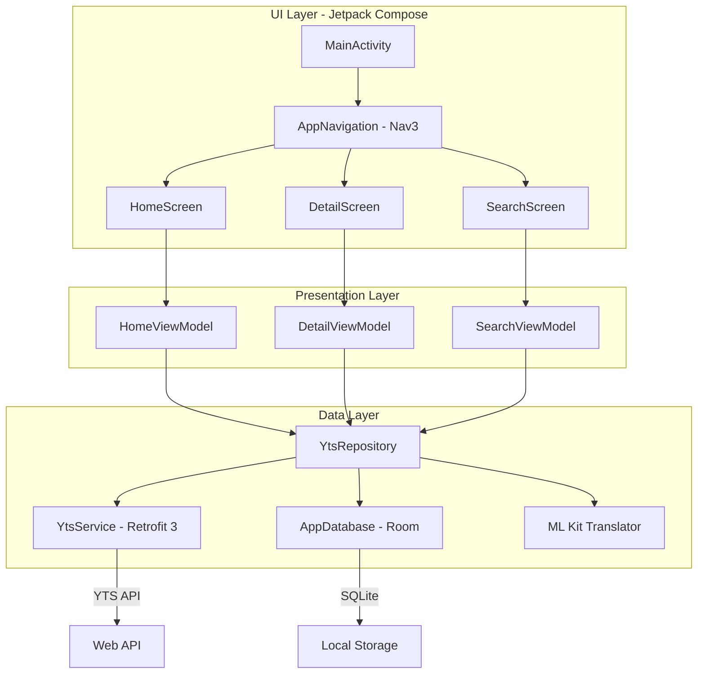
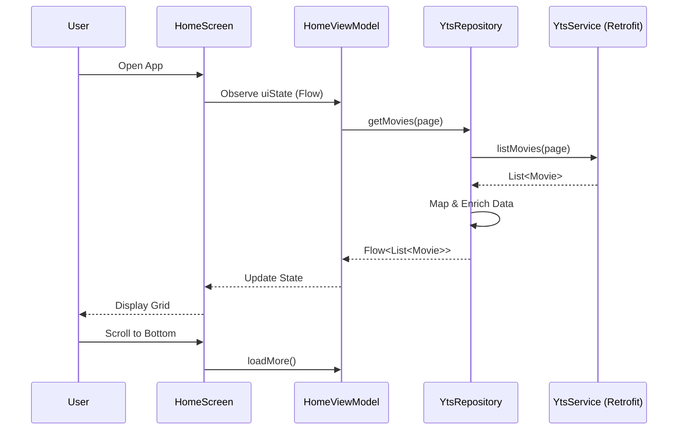
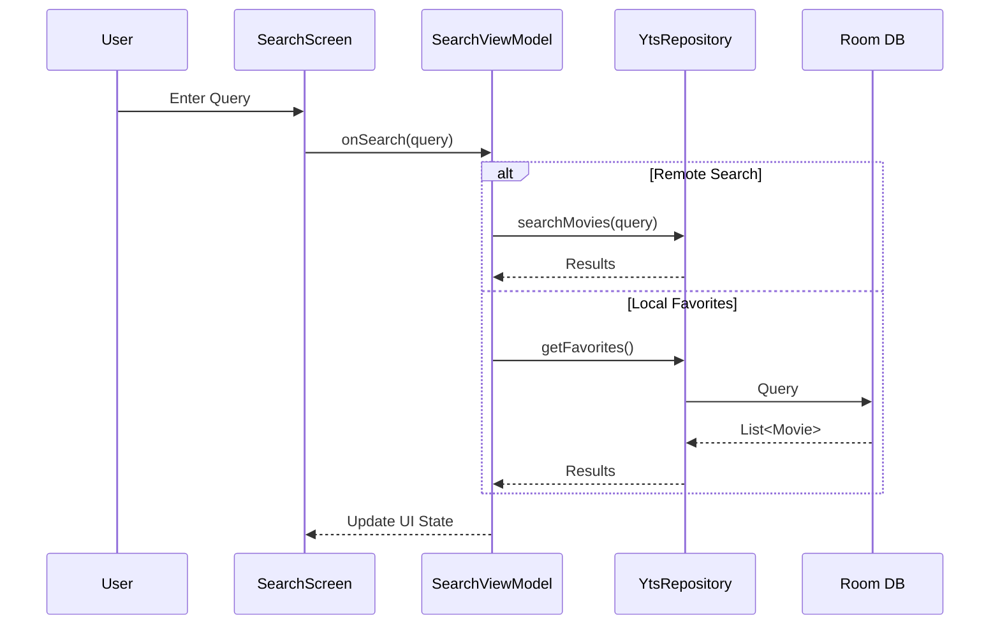
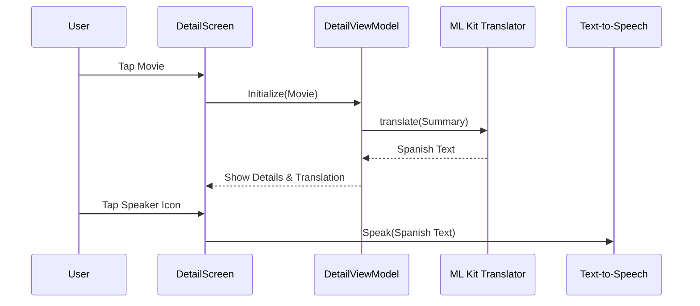

# La Torrentola 🎬

La Torrentola is a modern, high-performance Android application built with the latest technologies in the Android ecosystem. It serves as a movie discovery tool and a companion for **[Transdrone](https://play.google.com/store/apps/details?id=com.nascent.transdrone)**, focusing on seamless browsing, data visualization, and accessibility.

## 🚀 Modern Android Stack

This project has been fully refactored to use the most cutting-edge libraries and patterns:

-   **Language:** [Kotlin 2.1+](https://kotlinlang.org/) with the K2 compiler for faster builds and improved performance.
-   **UI:** [Jetpack Compose](https://developer.android.com/compose) with **Material 3**, providing a declarative and reactive user interface.
-   **Architecture:** [MVVM (Model-View-ViewModel)](https://developer.android.com/topic/architecture) with a clean separation of concerns.
-   **Dependency Injection:** [Hilt](https://developer.android.com/training/dependency-injection/hilt-android) for robust and scalable DI.
-   **Navigation:** [AndroidX Navigation 3](https://developer.android.com/jetpack/androidx/releases/navigation), the latest iteration for Compose-first navigation.
-   **Networking:** [Retrofit 3.0](https://square.github.io/retrofit/) with [OkHttp 5](https://square.github.io/okhttp/) and Coroutines support.
-   **Persistence:** [Room 2.8+](https://developer.android.com/training/data-storage/room) using [KSP (Kotlin Symbol Processing)](https://kotlinlang.org/docs/ksp-overview.html) for local caching.
-   **Async & Streams:** [Kotlin Coroutines](https://kotlinlang.org/docs/coroutines-overview.html) and [Flow](https://kotlinlang.org/docs/flow.html) for all asynchronous operations.
-   **Image Loading:** [Coil 3](https://coil-kt.github.io/coil/) for efficient, multi-platform ready image fetching.
-   **AI Integration:** [Google ML Kit Translate](https://developers.google.com/ml-kit/language/translation) for on-device movie summary translations.
-   **Build System:** [Android Gradle Plugin 9.2.0+](https://developer.android.com/studio/releases/gradle-plugin) and Version Catalogs (`libs.versions.toml`).

## 🏗️ Architecture Overview

The app follows a modern reactive architecture, moving away from legacy XML and Activities to a Single-Activity Compose model.


```mermaid
graph TD
    subgraph UI_Layer [UI Layer - Jetpack Compose]
        MA[MainActivity]
        NV[AppNavigation - Nav3]
        HS[HomeScreen]
        DS[DetailScreen]
        SS[SearchScreen]
    end

    subgraph Presentation_Layer [Presentation Layer]
        HVM[HomeViewModel]
        DVM[DetailViewModel]
        SVM[SearchViewModel]
    end

    subgraph Domain_Data_Layer [Data Layer]
        REP[YtsRepository]
        RS[YtsService - Retrofit 3]
        DB[AppDatabase - Room]
        MLK[ML Kit Translator]
    end

    MA --> NV
    NV --> HS & DS & SS
    HS --> HVM
    DS --> DVM
    SS --> SVM
    
    HVM & DVM & SVM --> REP
    REP --> RS
    REP --> DB
    REP --> MLK
    
    RS -->|YTS API| WAN[Web API]
    DB -->|SQLite| DISK[Local Storage]
```

## 🛠️ Key Features

1.  **Declarative UI:** Entirely built with Jetpack Compose for a smooth, fluid user experience.
2.  **State Management:** ViewModels leverage `StateFlow` and `collectAsStateWithLifecycle` to ensure UI state is handled safely.
3.  **Adaptive Grids:** Staggered grids that adapt to screen size (Phones, Tablets, Foldables).
4.  **Offline Support:** Room database caches movies for offline viewing and "Favorites" management.
5.  **On-Device AI:** Real-time translation of movie summaries from English to Spanish without cloud dependencies.
6.  **Navigation 3:** Uses the latest navigation APIs for passing complex data safely between screens.
7.  **Edge-to-Edge:** Full support for Android 15's edge-to-edge requirements using `WindowInsets`.
8.  **Performance:** Optimized with R8/ProGuard and modern serialization (Kotlinx Serialization + GSON).

## 🔄 Core Workflows

### 1. Movie Discovery & Pagination

```mermaid
sequenceDiagram
    participant U as User
    participant HS as HomeScreen
    participant VM as HomeViewModel
    participant R as YtsRepository
    participant N as YtsService (Retrofit)

    U->>HS: Open App
    HS->>VM: Observe uiState (Flow)
    VM->>R: getMovies(page)
    R->>N: listMovies(page)
    N-->>R: List<Movie>
    R->>R: Map & Enrich Data
    R-->>VM: Flow<List<Movie>>
    VM-->>HS: Update State
    HS-->>U: Display Grid
    U->>HS: Scroll to Bottom
    HS->>VM: loadMore()
```

### 2. Search & Filter

```mermaid
sequenceDiagram
    participant U as User
    participant SS as SearchScreen
    participant VM as SearchViewModel
    participant R as YtsRepository
    participant DB as Room DB

    U->>SS: Enter Query
    SS->>VM: onSearch(query)
    alt Remote Search
        VM->>R: searchMovies(query)
        R-->>VM: Results
    else Local Favorites
        VM->>R: getFavorites()
        R->>DB: Query
        DB-->>R: List<Movie>
        R-->>VM: Results
    end
    VM-->>SS: Update UI State
```

### 3. Movie Details & Translation

```mermaid
sequenceDiagram
    participant U as User
    participant DS as DetailScreen
    participant VM as DetailViewModel
    participant MLK as ML Kit Translator
    participant TTS as Text-to-Speech

    U->>DS: Tap Movie
    DS->>VM: Initialize(Movie)
    VM->>MLK: translate(Summary)
    MLK-->>VM: Spanish Text
    VM-->>DS: Show Details & Translation
    U->>DS: Tap Speaker Icon
    DS->>TTS: Speak(Spanish Text)
```

## 📦 Requirements & Setup

To ensure the project compiles and runs correctly:

1.  **Constants:** Ensure `app/src/main/java/com/martinrevert/latorrentola/constants/Constants.kt` exists:
    ```kotlin
    object Constants {
        const val YTS_BASE_URL = "https://yts.ag/api/v2/"
        const val PAGE_SIZE = 50
    }
    ```
2.  **Google Services:** Place your `google-services.json` in the `app/` directory for Firebase and ML Kit functionality.
3.  **Local Properties:** Define your signing keys if you plan to build release versions.

## 📈 Future Roadmap

- [ ] Multi-module architecture for better build times.
- [ ] Integration with more torrent providers.
- [ ] Shared Element Transitions with Compose.
- [ ] Predictive Back support.
- [ ] Interactive Widgets for "New Releases".

---

