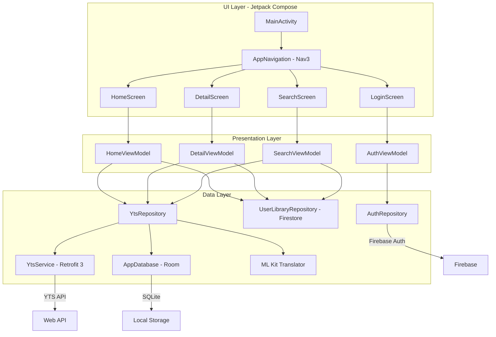
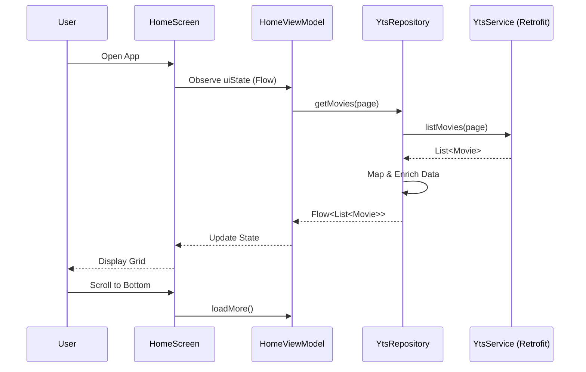
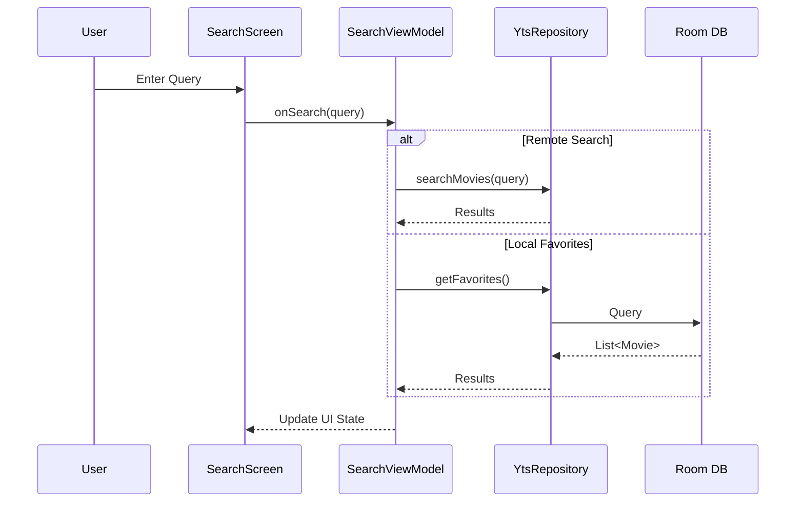
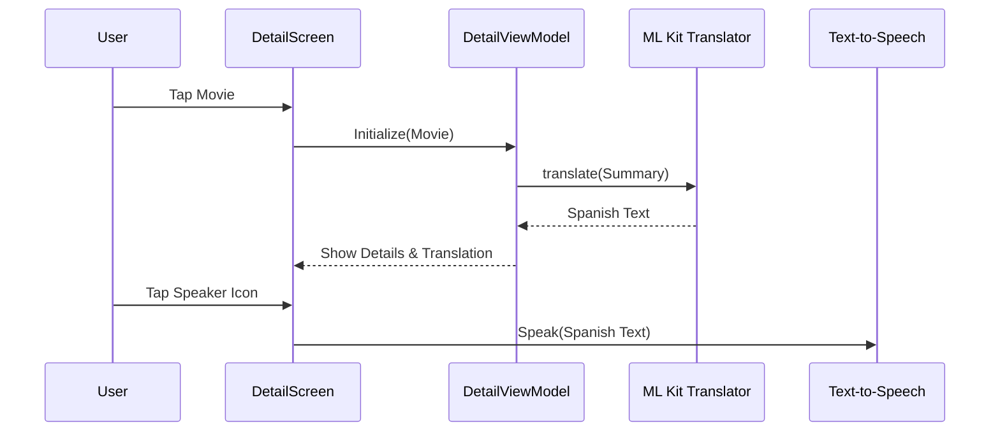
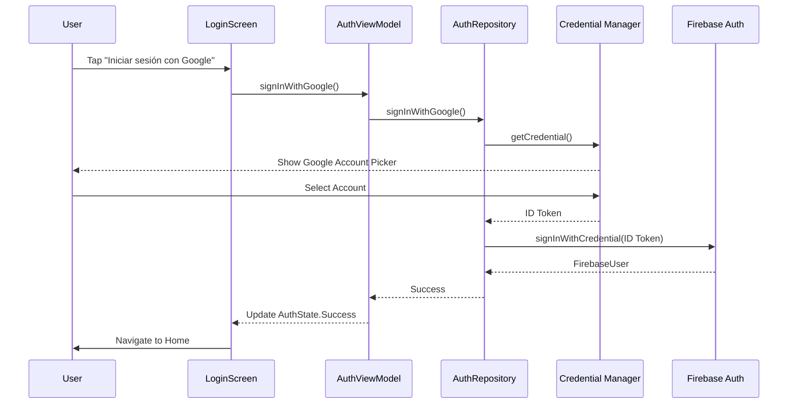

# La Torrentola 🎬

La Torrentola is a modern, high-performance Android application built with the latest technologies in the Android ecosystem. It serves as a movie discovery tool and a companion for **[Transdrone](https://play.google.com/store/search?q=transdrone&c=apps)** or **[DS Get](https://play.google.com/store/search?q=ds%20get&c=apps)** (if you use a Synology NAS), focusing on seamless browsing, data visualization, and accessibility.

## 🚀 Modern Android Stack

This project has been fully refactored to use the most cutting-edge libraries and patterns:

-   **Language:** [Kotlin 2.4+](https://kotlinlang.org/) with the K2 compiler for faster builds and improved performance.
-   **Authentication & Sync:** [Firebase Auth](https://firebase.google.com/docs/auth) with **Google Sign-in** and [Cloud Firestore](https://firebase.google.com/docs/firestore) for cross-device library synchronization.
-   **UI:** [Jetpack Compose](https://developer.android.com/compose) with **Material 3**, providing a declarative and reactive user interface.
-   **Architecture:** [MVVM (Model-View-ViewModel)](https://developer.android.com/topic/architecture) with a clean separation of concerns.
-   **Dependency Injection:** [Hilt](https://developer.android.com/training/dependency-injection/hilt-android) for robust and scalable DI.
-   **Navigation:** [AndroidX Navigation 3](https://developer.android.com/jetpack/androidx/releases/navigation), the latest iteration for Compose-first navigation.
-   **Networking:** [Retrofit 3.0](https://square.github.io/retrofit/) with [OkHttp 5](https://square.github.io/okhttp/) and Coroutines support.
-   **Persistence:** [Room 2.8+](https://developer.android.com/training/data-storage/room) using [KSP (Kotlin Symbol Processing)](https://kotlinlang.org/docs/ksp-overview.html) for local caching.
-   **Async & Streams:** [Kotlin Coroutines](https://kotlinlang.org/docs/coroutines-overview.html) and [Flow](https://kotlinlang.org/docs/flow.html) for all asynchronous operations.
-   **Image Loading:** [Coil 3](https://coil-kt.github.io/coil/) for efficient, multi-platform ready image fetching.
-   **AI Integration:** [Google ML Kit Translate](https://developers.google.com/ml-kit/language/translation) for on-device movie summary translations.
-   **Build System:** [Android Gradle Plugin 9.3.1+](https://developer.android.com/studio/releases/gradle-plugin) and Version Catalogs (`libs.versions.toml`).

## 🏗️ Architecture Overview

The app follows a modern reactive architecture, moving away from legacy XML and Activities to a Single-Activity Compose model.


```mermaid
graph TD
    subgraph UI_Layer [UI Layer - Jetpack Compose]
        MA[MainActivity]
        NV[AppNavigation - Nav3]
        LS[LoginScreen]
        HS[HomeScreen]
        DS[DetailScreen]
        SS[SearchScreen]
    end

    subgraph Presentation_Layer [Presentation Layer]
        AVM[AuthViewModel]
        HVM[HomeViewModel]
        DVM[DetailViewModel]
        SVM[SearchViewModel]
    end

    subgraph Domain_Data_Layer [Data Layer]
        AREP[AuthRepository]
        UREP[UserLibraryRepository - Firestore]
        REP[YtsRepository]
        RS[YtsService - Retrofit 3]
        DB[AppDatabase - Room]
        MLK[ML Kit Translator]
    end

    MA --> NV
    NV --> LS & HS & DS & SS
    LS --> AVM
    HS --> HVM
    DS --> DVM
    SS --> SVM
    
    AVM --> AREP
    AREP -->|Firebase Auth| FAN[Firebase]
    HVM & DVM & SVM --> UREP
    HVM & DVM & SVM --> REP
    REP --> RS
    REP --> DB
    REP --> MLK
    
    RS -->|YTS API| WAN[Web API]
    DB -->|SQLite| DISK[Local Storage]
```

## 🛠️ Key Features

1.  **Google Authentication & Cloud Sync:** Secure login using Firebase. Syncs your downloaded movies and specific versions across all your devices using Cloud Firestore.
2.  **Smart Favorites Management:** D-pad optimized multi-selection mode. Short-press to view details, long-press to enter selection mode for bulk deletion.
3.  **Declarative UI:** Entirely built with Jetpack Compose for a smooth, fluid user experience.
3.  **State Management:** ViewModels leverage `StateFlow` and `collectAsStateWithLifecycle` to ensure UI state is handled safely.
4.  **Adaptive Grids:** Staggered grids that adapt to screen size (Phones, Tablets, Foldables).
5.  **Offline Support:** Room database caches movies for offline viewing and "Favorites" management.
6.  **On-Device AI:** Real-time translation of movie summaries from English to Spanish without cloud dependencies.
7.  **Navigation 3:** Uses the latest navigation APIs for passing complex data safely between screens.
8.  **Edge-to-Edge:** Full support for Android 15's edge-to-edge requirements using `WindowInsets`.
9.  **Android TV Support:** Optimized for leanback experience with a 16:9 banner and D-Pad focus handling.
10. **Theming & Accessibility:** Dynamic UI adjustments (e.g., App Bar icon tint) that adapt to surface luminance in both Light and Dark themes.
11. **Performance:** Optimized with R8/ProGuard and modern serialization (Kotlinx Serialization + GSON).

## 🔄 Core Workflows

### 1. Movie Discovery & Pagination

```mermaid
sequenceDiagram
    participant U as User
    participant HS as HomeScreen
    participant VM as HomeViewModel
    participant R as YtsRepository
    participant N as YtsService (Retrofit)

    U->>HS: Open App
    HS->>VM: Observe uiState (Flow)
    VM->>R: getMovies(page)
    R->>N: listMovies(page)
    N-->>R: List<Movie>
    R->>R: Map & Enrich Data
    R-->>VM: Flow<List<Movie>>
    VM-->>HS: Update State
    HS-->>U: Display Grid
    U->>HS: Scroll to Bottom
    HS->>VM: loadMore()
```

### 2. Search & Filter

```mermaid
sequenceDiagram
    participant U as User
    participant SS as SearchScreen
    participant VM as SearchViewModel
    participant R as YtsRepository
    participant DB as Room DB

    U->>SS: Enter Query
    SS->>VM: onSearch(query)
    alt Remote Search
        VM->>R: searchMovies(query)
        R-->>VM: Results
    else Local Favorites
        VM->>R: getFavorites()
        R->>DB: Query
        DB-->>R: List<Movie>
        R-->>VM: Results
    end
    VM-->>SS: Update UI State
```

### 3. Movie Details & Translation

```mermaid
sequenceDiagram
    participant U as User
    participant DS as DetailScreen
    participant VM as DetailViewModel
    participant MLK as ML Kit Translator
    participant TTS as Text-to-Speech

    U->>DS: Tap Movie
    DS->>VM: Initialize(Movie)
    VM->>MLK: translate(Summary)
    MLK-->>VM: Spanish Text
    VM-->>DS: Show Details & Translation
    U->>DS: Tap Speaker Icon
    DS->>TTS: Speak(Spanish Text)
```

### 4. Authentication Workflow

```mermaid
sequenceDiagram
    participant U as User
    participant LS as LoginScreen
    participant VM as AuthViewModel
    participant R as AuthRepository
    participant CM as Credential Manager
    participant F as Firebase Auth

    U->>LS: Tap "Iniciar sesión con Google"
    LS->>VM: signInWithGoogle()
    VM->>R: signInWithGoogle()
    R->>CM: getCredential()
    CM-->>U: Show Google Account Picker
    U->>CM: Select Account
    CM-->>R: ID Token
    R->>F: signInWithCredential(ID Token)
    F-->>R: FirebaseUser
    R-->>VM: Success
    VM-->>LS: Update AuthState.Success
    LS->>U: Navigate to Home
```

## 📦 Requirements & Setup

To ensure the project compiles and runs correctly:

1.  **Credentials & `local.properties`:** Create a `local.properties` file in the project root (if not present) and add your Firebase Web Client ID. This prevents sensitive IDs from being committed to the repository:
    ```properties
    FIREBASE_WEB_CLIENT_ID=your_web_client_id_here
    ```
    The build system will automatically generate a `BuildConfig.WEB_CLIENT_ID` field for use in the app.

2.  **Constants:** Ensure `app/src/main/java/com/martinrevert/latorrentola/constants/Constants.kt` references the generated config:
    ```kotlin
    object Constants {
        const val YTS_BASE_URL = "https://movies-api.accel.li/api/v2/"
        val WEB_CLIENT_ID = BuildConfig.WEB_CLIENT_ID
    }
    ```

3.  **Google Services:** Place your `google-services.json` in the `app/` directory. Ensure:
    -   Your app's **SHA-1 fingerprint** is registered in the Firebase Console.
    -   **Google Sign-in** is enabled as an Authentication provider.
    -   **Cloud Firestore** is initialized with appropriate security rules.

## 📈 Future Roadmap

- [ ] Multi-module architecture for better build times.
- [ ] Integration with more torrent providers.
- [ ] Shared Element Transitions with Compose.
- [ ] Predictive Back support.
- [ ] Interactive Widgets for "New Releases".

## 🧪 Testing

The project includes a suite of modern Android unit tests focused on the data layer, business logic, and serialization.

### Testing Stack
- **JUnit 4:** Core testing framework.
- **MockK:** A powerful mocking library for Kotlin.
- **Turbine:** A small library for testing Kotlin Coroutines `Flow`.
- **Google Truth:** A library for performing assertions with better readability.
- **Kotlinx Coroutines Test:** Utilities for testing asynchronous code.

### Running Tests
To run all unit tests from the command line:
```powershell
./gradlew testDebugUnitTest
```

> [!NOTE]
> The project is configured via `gradle.properties` to support modern JDKs (21+) by enabling dynamic agent loading and opening necessary internal packages for build tools and MockK/ByteBuddy. This avoids `sun.misc.Unsafe` warnings during both compilation and testing.

### Coverage Areas
- **Repositories:** Verifying the interaction between network services and local DAOs.
- **ViewModels:** Testing state management, pagination, filtering, and side-effects (Voice, Translation).
- **Room Converters:** Ensuring complex data types (Lists, Dates) are correctly converted to/from JSON/Long for persistence.
- **Serialization:** Validating that models are correctly serialized for Navigation 3 payloads.

---

